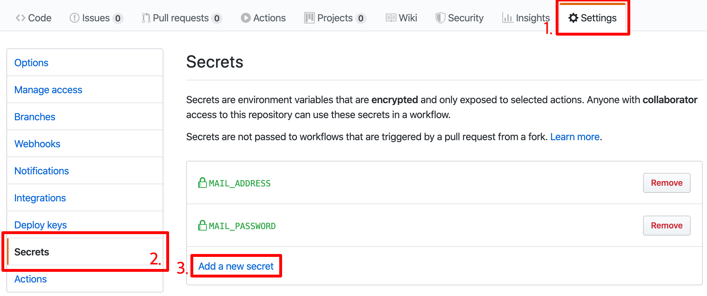

# send-mailer
 - This is GitHub cusotem action.
 - Dynamically send an email with attachments.

## Sample .yml
~~~yaml
- name: Send email
  uses: devellany/send-mailer@v1.0.0
  with:
    host: smtp.google.com
      # Optional port (defaults to 465)
      port: 465
      account: ${{secrets.ACCOUNT}}
      password: ${{secrets.MAIL_PASSWORD}}
      sender: devellany
      from: ${{secrets.MAIL_ADDRESS}}
      to: devellay@dico.me
      subject: mail title.
      body: your messages.
      # Optional content type (defaults to text/plain)
      contentType: text/plain
      # Optional attachment files (JSON type. require property 'path')
      attachments: '[{"path":"README.md"}]'
~~~

## How to Secrets.KEY


## What is 'Dynamically' send an email?
 Some properties can read files. The prefix 'file://' if you want to read a file.
### Applicable properties
 - to
 - subject
 - body
 - contetnType
 - attachments
 ```yaml
- name: Send email
  uses: devellany/send-mailer@v1.0.0
  with:
    host: smtp.google.com
      account: ${{secrets.ACCOUNT}}
      password: ${{secrets.MAIL_PASSWORD}}
      sender: devellany
      from: ${{secrets.MAIL_ADDRESS}}
      to: devellay@dico.me
      subject: mail title.
      body: file://README.md
      contentType: text/html
      attachments: file://attachmets.json
```
